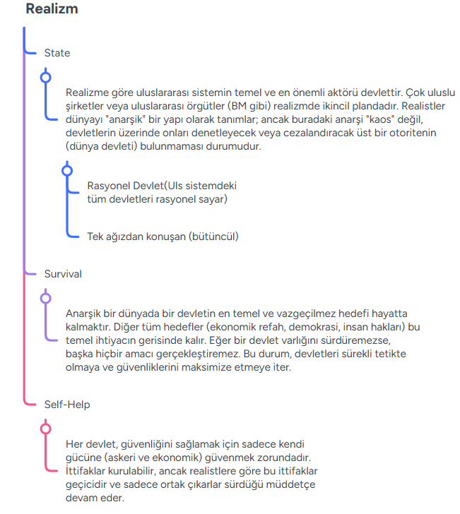

Hocanın anlatığı şekil 

### Realizm

Realizmin araştırdığı 5 temel soru:

1. uluslararası ilişkilerin doğası nedir ?

uluslararası ilişkiler çatışmaların temelinde insan doğası var (bencil, çıkarcı) (bunu idda eden kişiler Hobbes, Morghentau)

2. uluslararası ilişkilerin gerçekleştirdiği ortamın temel özelikleri nelerdir ?

Anarşi(güç tekeline sahip bir üst otoritenin olmaması) o yüzden uls ilişkilerde self-help(kendi başın çaresine kendin bak) ilkesi geçerli

3. Temel aktör kimdir ?

Devlet(Realistler devlet dışı aktörleri göz arda ederler 'state') 

4. Temel aktörün öncelikli amacı nedir ?

Hayata kalma ('survival')

5. Bu amaca uluşmak için kulandığı başlıca araçlar ?

Güç ('A' aktörünün 'B' aktörüne eylemlerini şekilendire bilme yeteneğidir  )

### Farklı Realizm Yaklaşımları(Sınav için önemli değil) 

Klasik Realizm
Yapısal Realizm
Neoklasik Realizm

### Önemli Yazarlar ve Realizm teorisinin oluşmasında  katkıları :

#### Machiavelli ve Realizm 

1. Niccolò Machiavelli: Siyasal Realizmin Mimarı
Machiavelli, ahlak ve siyaseti birbirinden ayıran ilk modern düşünürlerden biridir. Realizme katkısı, "devletin bekası" (raison d'état) kavramıdır.

Güç Odaklılık: Liderin temel görevi devletin hayatta kalmasını sağlamaktır. Bunun için gerekirse ahlaki kuralları göz ardı edebilir.

Pragmatizm: "Amaca giden her yol mübahtır" anlayışıyla, uluslararası ilişkilerde duygusallığa veya idealizme yer olmadığını savunmuştur.

İnsan Doğası: İnsanların bencil ve nankör olduğunu varsayarak, bir hükümdarın sevilmekten ziyade korkulması gereken biri olması gerektiğini vurgular.

#### Thomas Hobbes ve Realizm 

2. Thomas Hobbes: Kaos ve Güvenlik İhtiyacı
Hobbes, realizmin "anarşi" ve "güvenlik ikilemi" kavramlarının felsefi temelini atmıştır.

Doğa Durumu: Devletin olmadığı bir ortamı "herkesin herkesle savaşı" olarak tanımlar. Uluslararası sistemde üstün bir otorite (dünya devleti) olmadığı için, devletler her zaman bu "doğa durumu" içinde, yani bir savaş tehdidi altındadır.

Güvenlik Arayışı: Devletlerin temel motivasyonu korkudur. Bu korku, devletleri sürekli olarak güç biriktirmeye ve silahlanmaya iter.

#### Hans J. Morgenthau ve Realizm

3. Hans J. Morgenthau: Klasik Realizmin Kurucusu
Morgenthau, realizmi modern bir akademik disiplin ve sistemli bir teori haline getiren isimdir. Uluslararası Politika adlı eseri bu okulun "İncil"i kabul edilir.

Güç Olarak Tanımlanan Çıkar: Politikanın temelinde "güç" kavramı yatar. Devletler ulusal çıkarlarını her zaman güç üzerinden tanımlarlar.

Evrensel Prensiplerin Reddi: Devletlerin davranışlarını ahlaki değerlerin değil, stratejik çıkarların belirlediğini savunur.

Siyasetin Özerkliği: Siyasetin kendine has yasaları olduğunu ve bu yasaların insan doğasından kaynaklandığını ileri sürer.

 
### Hans J. Morgenthau 6 ilkesi(sınav için önemli) 

Hans J. Morgenthau, 1948 yılında yayımlanan *Politics Among Nations* (Uluslararası Politika) adlı eserinde Klasik Realizm'in çerçevesini çizen altı temel ilkeyi belirlemiştir. Bu ilkeler, uluslararası politikanın rasyonel ve nesnel yasalarla anlaşılabileceğini savunur.

İşte Morgenthau’nun meşhur **6 İlkesi**:

### 1. Siyasetin Nesnel Yasaları İnsan Doğasına Dayanır
Siyaset, toplum gibi, kökleri insan doğasında bulunan nesnel yasalar tarafından yönetilir. Bu yasalar zamandan ve kişisel tercihlerden bağımsızdır. Bu nedenle, tarihe bakarak siyasetin nasıl işlediğine dair rasyonel bir teori geliştirmek mümkündür.

### 2. Çıkar, Güç Terimleriyle Tanımlanır
Realizmin en merkezi ilkesidir. Uluslararası politikayı anlamak için devlet adamlarının motivasyonlarına veya ideolojilerine değil, **"güç olarak tanımlanan çıkar"** kavramına bakılmalıdır. Devletler, dış politikalarını ahlaki değerlere göre değil, güçlerini korumak veya artırmak üzerine kurarlar.

### 3. Çıkar Kavramı Sabittir Ancak İçeriği Değişebilir
"Çıkar" kavramı siyasetin özüdür ve değişmez; ancak gücün içeriği ve çıkarın nasıl elde edileceği zamana, mekâna ve siyasi kültüre göre farklılık gösterebilir. Örneğin, geçmişte toprak kazanımı ana güç göstergesiyken, bugün teknolojik veya ekonomik üstünlük daha ön planda olabilir.

### 4. Evrensel Ahlak İlkeleri Devletlere Doğrudan Uygulanamaz
Bireyler için geçerli olan ahlaki kurallar (örneğin "yalan söyleme" veya "öldürme"), devletlerin eylemlerine olduğu gibi yansıtılamaz. Devletin en yüksek ahlaki görevi **hayatta kalmaktır (beka)**. Bir liderin kendi halkını tehlikeye atma pahasına soyut ahlak kurallarına uyması, Morgenthau'ya göre "ahlaksızlık" olarak kabul edilir.

### 5. Ulusların Ahlaki Hedefleri ile Evrensel Yasalar Karıştırılmamalıdır
Hiçbir devlet, kendi ulusal çıkarlarını veya ideolojisini "evrensel bir ahlak yasası" gibi dünyaya dayatmamalıdır. Her devletin kendi çıkarı peşinde koştuğunu kabul etmek, devletlerin birbirini daha rasyonel değerlendirmesini sağlar ve körü körüne yapılan ideolojik savaşları (haçlı seferi mantığını) engeller.

### 6. Siyasal Alanın Özerkliği
Siyaset bilimi; hukuk, ekonomi veya ahlak gibi diğer disiplinlerden bağımsız ve özerktir. Bir ekonomist bir olaya "refah" açısından, bir hukukçu "yasallık" açısından bakarken; bir siyaset bilimci **"Bu politika güce nasıl etki eder?"** sorusuyla bakmalıdır.

---

### İlkelerin Özeti

| İlke No | Temel Odak | Kısa Açıklama |
| :--- | :--- | :--- |
| **1** | İnsan Doğası | Siyasetin değişmez, nesnel yasaları vardır. |
| **2** | Güç ve Çıkar | Politikanın ana motoru güç arayışıdır. |
| **3** | Değişkenlik | Çıkar sabittir, ancak yöntemler çevreye göre değişir. |
| **4** | Devlet Ahlakı | Bekâ (hayatta kalma), bireysel ahlaktan üstündür. |
| **5** | Anti-İdealizm | Kendi ahlakını dünyaya dayatmak tehlikelidir. |
| **6** | Özerklik | Siyaset, kendine has mantığı olan ayrı bir alandır. |
