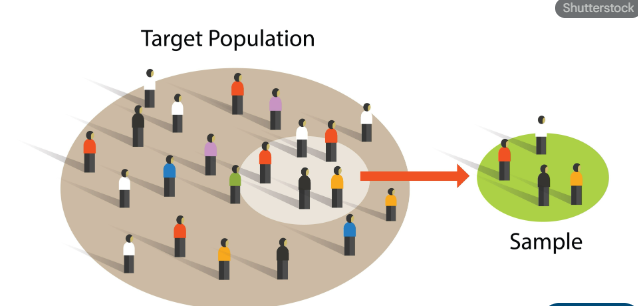
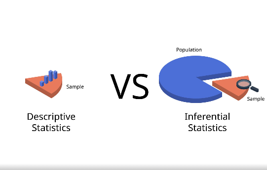
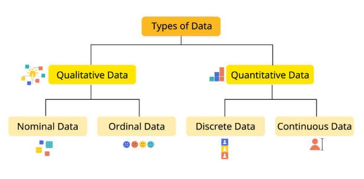
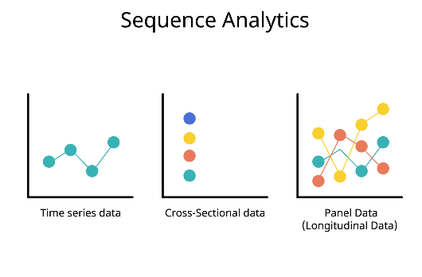

---

### **1. İstatistiğin Tanımı ve Önemi**

**Tanım:** İstatistik; verilerin belirli bir amaç doğrultusunda bilimsel yöntemlerle toplanması, düzenlenmesi, özetlenmesi, analiz edilmesi ve bu analizler sonucunda belirsizlik altında doğru kararlar verebilmek için yorumlanması sürecini kapsayan bir bilim dalıdır. Modern dünyada istatistik, sadece sayılardan ibaret değil, bir "karar verme sanatı" olarak görülür.

**İstatistiğin Önemi:**
* **Bilimsel Araştırmalar:** Sosyal bilimlerden (Uluslararası İlişkiler, Ekonomi vb.) fen bilimlerine kadar tüm alanlarda nicel yaklaşımların temeli istatistiktir.
* **Etkin Yurttaşlık:** H.G. Wells’in ifadesiyle; "İstatistiksel düşünmek, artık etkin bir yurttaşlık için okuma-yazma bilmek kadar gerekli hale gelmiştir."
* **Günlük Hayat ve Politika:** Hükümetlerin ekonomi politikaları (işsizlik, enflasyon), medya araçlarındaki veriler (hava durumu, seçim sonuçları) ve stratejik planlamalar tamamen istatistiksel verilere dayanır.
* **Hata Payı Yönetimi:** İstatistik, matematiksel kesinlik ile gerçek dünya verileri arasındaki farkı yönetir. Formülize edilmiş haliyle: **İstatistik ≈ Matematik + Hata** olarak tanımlanabilir.

---

### **2. Temel Kavramlar**

İstatistiksel bir araştırmanın temelini oluşturan ana yapı taşları şunlardır:

#### **A. Birim (Gözlem Birimi)**
Hakkında bilgi toplanan ve üzerinde ölçüm yapılan her bir birey, nesne veya olaya **birim** denir. 
* *Örnek:* Bir ülkedeki nüfus sayımında her bir "insan", bir şirketteki kalite kontrolünde her bir "ürün" bir birimdir.

#### **B. Değişken**
Birimden birime farklı değerler alabilen özelliklere denir. Değişkenler iki ana gruba ayrılır:
1.  **Nitel (Kategorik) Değişkenler:** Sayısal olarak ifade edilemeyen, sadece gruplandırılabilen özelliklerdir (Örn: Cinsiyet, meslek, kan grubu).
2.  **Nicel (Sayısal) Değişkenler:** Sayısal değerlerle ifade edilen özelliklerdir.
    * *Kesikli Değişken:* Sadece tam sayılarla ifade edilen (Örn: Bir sınıftaki öğrenci sayısı).
    * *Sürekli Değişken:* Belirli bir aralıkta sonsuz değer alabilen (Örn: Boy, kilo, gelir).

#### **C. Anakütle (Popülasyon / Evren)**
Bir araştırma kapsamında incelenmek istenen tüm birimlerin oluşturduğu bütünsel kümedir. Genellikle "N" harfi ile gösterilir.
* *Örnek:* Türkiye'deki tüm üniversite öğrencileri.

#### **D. Örneklem**
Anakütlenin içerisinden belirli yöntemlerle seçilen, anakütleyi temsil etme yeteneğine sahip olan ve üzerinde asıl çalışmanın yürütüldüğü alt kümedir. Genellikle "n" harfi ile gösterilir.
* **Örnekleme:** Anakütleden örneklem seçme işlemine denir. Amaç, tüm anakütleyi incelemenin getireceği maliyet ve zaman kaybından kurtulmaktır.

#### **E. Parametre vs. İstatistik**
Bu iki kavram, ölçümün hangi kümeden yapıldığına göre değişir:
* **Parametre:** Doğrudan **anakütle (N)** üzerinden hesaplanan sayısal değerlerdir (Örn: Anakütle ortalaması "μ").
* **İstatistik:** **Örneklem (n)** verilerinden hesaplanan ve parametreyi tahmin etmek için kullanılan sayısal değerlerdir (Örn: Örneklem ortalaması "$\bar{x}$").

---

### **1. Betimsel ve Çıkarımsal İstatistik**

İstatistiksel yöntemler, verinin kullanım amacına göre iki ana kola ayrılır:

* **Betimsel (Tanımlayıcı) İstatistik:** Toplanan verilerin sayısal veya görsel yöntemlerle özetlenmesi ve sunulmasıdır. Anakütlenin tamamı veya örneklem üzerinde çalışılabilir. Amacı, karmaşık veriyi anlaşılır hale getirmektir.
    * *Yöntemler:* Tablo ve grafikler (histogram, pasta grafiği vb.), merkezi eğilim ölçüleri (ortalama, medyan, mod) ve dağılım ölçüleri (standart sapma, varyans).
* **Çıkarımsal (Tümevarımsal) İstatistik:** Örneklemden elde edilen sonuçları kullanarak, bu örneklemin seçildiği **anakütle (popülasyon) hakkında tahminlerde bulunma** ve karar verme sürecidir.
    * *Yöntemler:* Hipotez testleri, güven aralıkları ve regresyon analizi. Burada temel amaç, sınırlı bilgiden hareketle bütüne dair genel yargılara varmaktır.

---

### **2. Sayısal (Nicel) ve Kategorik (Nitel) Veriler**

Veriler, temsil ettikleri özelliklerin yapısına göre ikiye ayrılır:

* **Kategorik (Nitel) Veriler:** Birimlerin ölçülemeyen, ancak sınıflara ayrılabilen özelliklerini belirtir. Sayısal bir büyüklük ifade etmezler.
    * *Örnek:* Cinsiyet (Erkek/Kadın), Medeni Durum (Evli/Bekar), Plaka Kodları, Eğitim Düzeyi.
* **Sayısal (Nicel) Veriler:** Miktar veya sayı bildiren, matematiksel işlemler yapılabilen verilerdir. İkiye ayrılır:
    1.  **Kesikli Veriler:** Sayma yoluyla elde edilen, tam sayı değerleri alan verilerdir (Örn: Bir sınıftaki öğrenci sayısı, bir evdeki oda sayısı).
    2.  **Sürekli Veriler:** Ölçüm yoluyla elde edilen ve belirli bir aralıkta sonsuz değer alabilen verilerdir (Örn: Boy uzunluğu, ağırlık, döviz kuru, sıcaklık).

---

### **3. Zaman Serileri ve Yatay Kesit Veriler**

Verilerin hangi zaman diliminde veya hangi birimlerden toplandığına göre yapılan sınıflandırmadır:

* **Zaman Serileri (Time Series Data):** Tek bir birimin (bir ülke, bir şirket, bir birey) belirli bir değişkenine ait değerlerin **zaman içerisindeki (günlük, aylık, yıllık) değişimini** gösteren verilerdir. Zaman sıralaması kritiktir.
    * *Örnek:* Türkiye’nin 2010-2024 yılları arasındaki yıllık enflasyon oranları.
* **Yatay Kesit Veriler (Cross-Sectional Data):** Belirli bir **zaman noktasında (anlık)**, farklı birimlerden toplanan verilerdir. Burada zaman sabittir, birimler değişkendir.
    * *Örnek:* 2024 yılı Ocak ayı itibarıyla tüm AB ülkelerinin işsizlik oranları.
* **Panel Veri (Karma Veri):** Hem zaman serisi hem de yatay kesit özelliklerini barındıran verilerdir (Örn: 10 farklı ülkenin 5 yıllık büyüme verileri).

---

