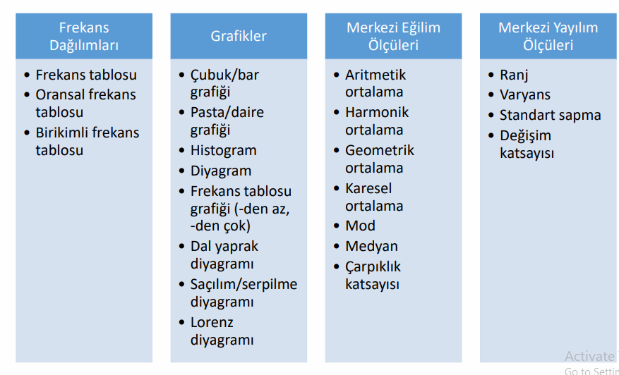

### ---

**1\. İstatistikte İzlenen Yol (Tekrar)**

Bir istatistiksel araştırma rastgele yapılmaz; belirli bir mantık silsilesi izler:

1. **Veri Toplama:** Anket, gözlem veya deneyle ham veriye ulaşılır.  
2. **Veri İşleme ve Özetleme:** Veriler ayıklanır ve düzenlenir.  
3. **Sunum:** Tablo ve grafikler yardımıyla veriler görselleştirilir.  
4. **Analiz:** İstatistiksel yöntemler (ortalama, varyans vb.) uygulanır.  
5. **Karar:** Elde edilen bulgularla sonuçlara varılır ve gelecek öngörüsü yapılır.

### ---

**2\. İstatistik \= Matematik \+ Hata (Ne Demek?)**

Matematik kesinlik bildirir ($2+2=4$); ancak istatistik gerçek dünya verileriyle uğraştığı için işin içine **belirsizlik** girer.

* **Açıklama:** Bir toplumun tamamını (anakütle) incelemek yerine bir kısmını (örneklem) incelediğimizde, bulduğumuz sonuç gerçek değerden az da olsa sapabilir. İşte bu "sapma" veya "belirsizlik" payına **hata** denir. İstatistik, bu hatayı bilimsel yöntemlerle ölçen ve minimize eden bir disiplindir.

### ---

**3\. Veri Ölçüm Düzeyleri (Basit Anlatım)**

Ölçüm Düzeyleri = Veriye Ne Yapabilirim?

Aslında soru şu:

Bu veriye sadece bakabilir miyim?
Sıralayabilir miyim?
Hesap yapabilir miyim?

İstatistik bu yüzden ölçüm düzeylerini 4 seviyeye ayırır.

Ölçüm düzeyleri, verinin içindeki bilginin "kalitesini" ve "miktarını" belirler. En basitten en gelişmişe doğru bir merdiven gibi düşünebilirsin:

#### **A. Nominal (Sınıflayıcı) Ölçek**

* **Mantık:** Sadece isim verme ve gruplandırmadır. Sayıların hiçbir büyüklük anlamı yoktur.  
* **Örnek:** Cinsiyet (1: Erkek, 2: Kadın), Plaka kodları (38: Kayseri, 50: Nevşehir). Burada 50, 38'den "büyük" değildir, sadece bir koddur.

#### **B. Sıralayıcı (Ordinal) Ölçek**

* **Mantık:** Gruplar arasında bir "üstünlük" veya "sıra" vardır ama aradaki farkın miktarı belli değildir.  
* **Örnek:** Eğitim durumu (İlkokul, Lise, Üniversite). Üniversite mezunu liseden "üsttedir" ama aradaki fark sayısal olarak ölçülemez.

#### **C. Aralıklı (Interval) Ölçek**

* **Mantık:** Sayısal farklar anlamlıdır ancak **sıfır noktası gerçek (mutlak) yokluğu ifade etmez.**  
* **Örnek:** Hava sıcaklığı ($0^{\\circ}C$). Hava 0 derece olduğunda "ısı yok" demek değildir, bu sadece bir referans noktasıdır.

#### **D. Oran (Ratio) Ölçek**

* **Mantık:** En gelişmiş ölçektir. **Sıfır noktası "mutlak yokluk" demektir.** Her türlü matematiksel işlem (katı, oranı) yapılabilir.  
* **Örnek:** Boy, kilo, gelir. Gelirin 0 TL olması, hiç para olmadığı anlamına gelir. 100 TL, 50 TL'nin tam 2 katıdır.

### ---

**4\. Veri Türleri ve Ölçek İlişkisi**

* **Kategorik (Nitel) Veri:** **Nominal** ve **Sıralayıcı** ölçekleri kapsar. Çünkü burada temel amaç sayısal hesaplama değil, sınıflandırma ve sıralamadır. (Örn: "Mavi gözlüler" bir sayıdır ama nitelik bildirir).  
* **Sayısal (Nicel) Veri:** **Aralıklı** ve **Oran** ölçekleri kapsar. Burada sayılar gerçek miktarları temsil eder ve aritmetik ortalama gibi işlemler yapılabilir.

### ---

**5\. Tamsayım vs. Örnekleme Yöntemi**

* **Tamsayım (Sayım):** Anakütledeki (evrendeki) tüm birimlerin tek tek incelenmesidir (Örn: Genel Nüfus Sayımı). Çok maliyetli ve zordur.  
* **Örnekleme:** Anakütleyi temsil edecek küçük bir grubun (örneklemin) seçilip incelenmesidir. Daha hızlı ve ekonomiktir.

### ---

**6\. Betimsel vs. Çıkarımsal İstatistik**

* **Betimsel (Tanımlayıcı):** Elindeki veriyi fotoğraflar. "Sınıfın not ortalaması 70" dersen betimleme yaparsın. (Özetler ve sunar).  
* **Çıkarımsal (Tümevarımsal):** Elindeki küçük veriden (örneklem) büyük grup (anakütle) hakkında tahmin yürütür. "Bu 50 öğrencinin başarısına bakılırsa, tüm üniversite başarılıdır" demek bir çıkarımdır.

Çıkarımsal istatistik, örnekleme yöntemi ile toplanan verilerin anakütleye genellenmesi sürecidir. Betimsel istatistik ise hem tamsayım hem de örnekleme ile elde edilen verilerin resmini çekme yöntemidir

### ---

**7\. Betimsel İstatistik Tablosu**

### ---
 Frekans Dağılımlar
 Grafik ve Tablo gösterimleri