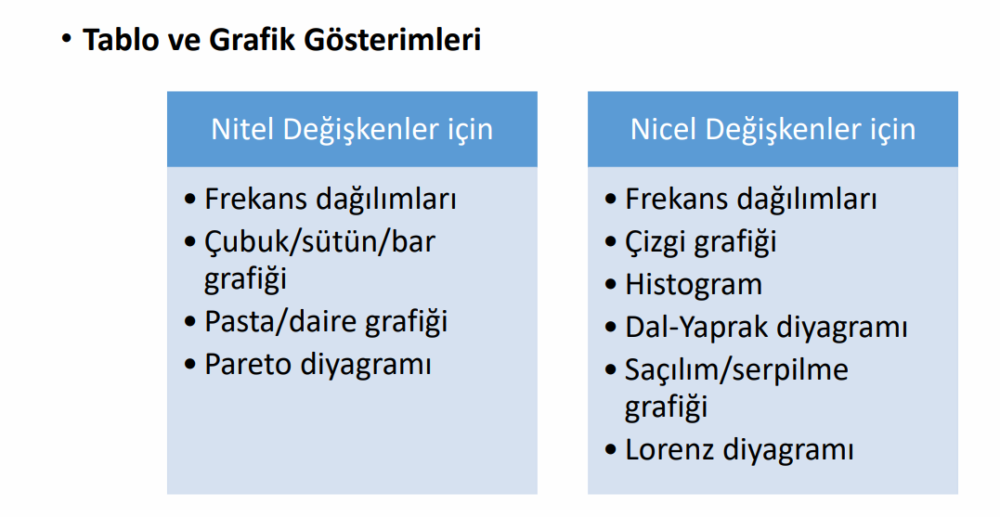
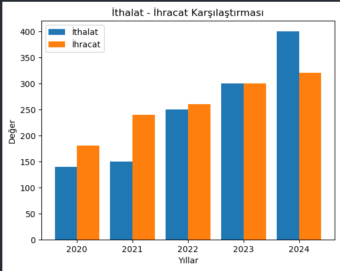
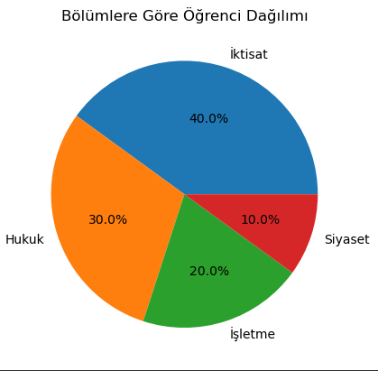
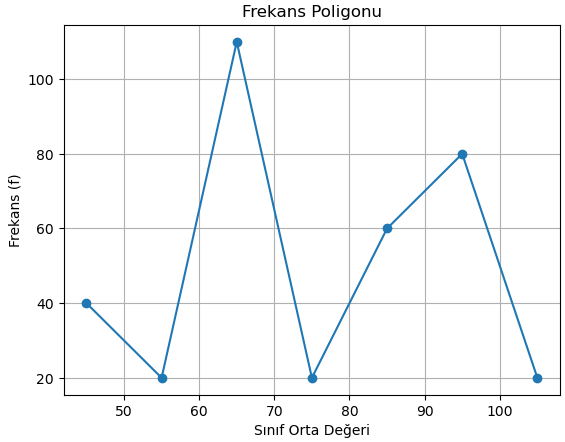

# 1. FREKANS TABLOLARI (EN ÖNEMLİ KONU)

## 🔹 Frekans Tablosu Nedir?

Verilerin **kaç kez tekrar ettiğini** gösterir.

---

## 🔹 Frekans Türleri (Sınavın Kalbi 💥)

### 1. Basit Frekans (f)

👉 Her sınıfta kaç veri var

---

### 2. Oransal Frekans (rf)

👉 Toplama oranı

```
rf = f / n
```

---

### 3. Yüzdelik Frekans (%)

👉 Oranın yüzde hali

```
% = rf × 100
```

---

### 4. Birikimli (Kümülatif) Frekans

👉 Üstüne ekleyerek gider

```
f₁
f₁ + f₂
f₁ + f₂ + f₃
```

---

### 5. Birikimli Oransal Frekans

👉 Oransalların toplamı

---

## 🎯 SINAVDA GELECEK

✔ Sınıf sayısı verilir
✔ Sınıf aralığı hesaplanır
✔ Tablo doldurulur
✔ 5 frekans türü istenir

---

# 2. GRAFİK TÜRLERİ 

grafikler 2’ye ayrılır:

---

# 🔵 A) NİTEL VERİ GRAFİKLERİ

(örn: cinsiyet, şehir, takım)

## 1. Çubuk (Bar) Grafiği

Örnek:

yıllar = [2020, 2021, 2022, 2023, 2024]
İthalat = [140, 150, 250, 300, 400]
İhracat = [180, 240, 260, 300, 320]
---



---

✔ X ekseni → kategoriler(bizim örnegimizde yıllar)
✔ Y ekseni → frekans(bizde İthalat İhracat)

👉 **Ne gösterir?**
→ Karşılaştırma

---

## 2. Pasta (Daire) Grafiği

👉 Yüzdeyi gösterir

✔ Toplam = %100
✔ Her dilim bir oran

👉 **Ne zaman kullanılır?**
→ Oransal dağılım

Örnek:

Öğrencilerin bölüm dağılımı diyelimki

| Bölüm   | Öğrenci |
| ------- | ------- |
| İktisat | 40      |
| Hukuk   | 30      |
| İşletme | 20      |
| Siyaset | 10      |

---



---


# 🔴 B) NİCEL VERİ GRAFİKLERİ

(örn: yaş, gelir, sıcaklık)

---

## 1. Histogram (EN KRİTİK)

👉 Frekans dağılımının grafiği

✔ Sınıflar bitişik
✔ Boşluk yok
✔ Dikdörtgenler var

👉 **Ne gösterir?**
→ Veri dağılımı

---

## 2. Frekans poligonu

👉 Frekans Poligonu

✔ X ekseni → Sınıf orta değerleri
✔ Y ekseni → Frekans (f)
✔ Noktalar → çizgi ile birleştirilir


👉 Örnek: 

sınıflar alınmış

40–50
50–60
60–70
70–80
80–90
90–100
100–110

Sınıf orta değeri bulunmuş

(Sınıf alt + üst) / 2

ORTA NOKTALAR:

-----> 45, 55, 65, 75, 85, 95, 105



---


